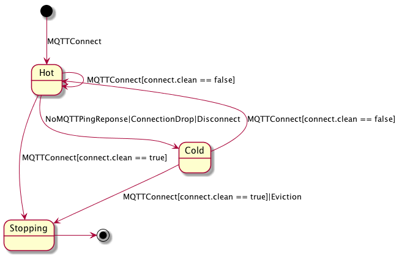

# Maschinen Meister
## IoT for the Masses

_Maschinen Meister is a MQTT Proxy. Meaning it adapts an **outside** MQTT world to an **inside** functional world._

MQTT is a protocol adapted to embedded hardware constraints and very lousy connection options.
This does not map nicely to a world of distributed stream processing, big data and the likes.
Hence we developed Maschinen Meister to connect these worlds as a slim proxy to adapt the worlds.

## Session

Each session is represented by its own object.
The class collaborates with following domain objects:
* Connection: A connection will initiate a session, but may be lost and recovered.  
* Subscription: A subscription is session specific and will if required pull and queue messages from central topics.
* Topic: Is a client / session agnostic broker system on which messages are exhanged.

### States

In the _Hot State_, a client is maintaining an active connection with the server and can receive messages from its subscriptions.
If the server detects a disconnection of the client if fall backs in a _Cold State_.
In this state only the messages with certain QoS requirements are retained for future processing.
Also the session will fire its Will Message if it drops in the _Cold State_.

_[MQTT-3.1.2-6]_ is unclear on the question if Will Messages are sent, when a _Hot Session_ is killed by a _clean_ MQTTConnect request.
As the client is not disconnected it is assumed that Will is to be sent, hence the Session immediately drops into the _Stopping State_.

Publishing of Messages is only possible in the _Hot State_ as a client is required to be connected to initiate the request.
Publishing a message on a new topic, may trigger its creation.
Also a message can only be published to the client when the subscription is _Hot_.

Topics have no dedicated states in their lifecycle, as their are simple piping.

Subscriptions can only managed in the _Hot State_ as a client is required to be connected to initiate the request.
Only in _Hot State_ and the _Cold State_ the session can maintain subscriptions.
Subscriptions may trigger the creation of topics as well.
Subscriptions can have their own lifecycle as well.

In the Stopping State the internal state is completely removed and all subscriptions and other objects are dropped.

An Eviction occurs when the server decides to evict stale connections.
This is done to prevent resource exhaustion and may be configurable.

## State Reference

Run mvn clean com.github.jeluard:plantuml-maven-plugin:generate to update the diagrams.